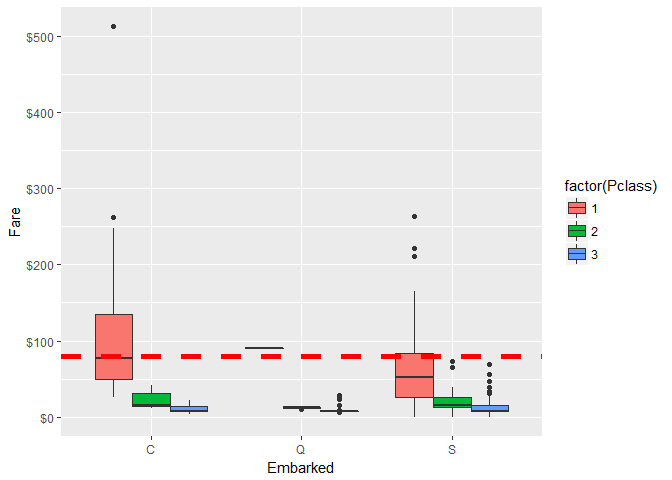
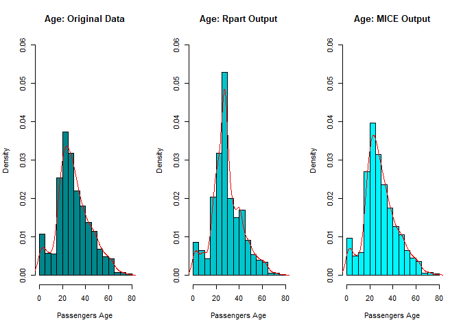
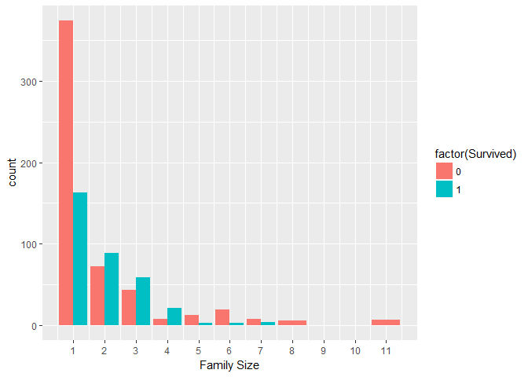
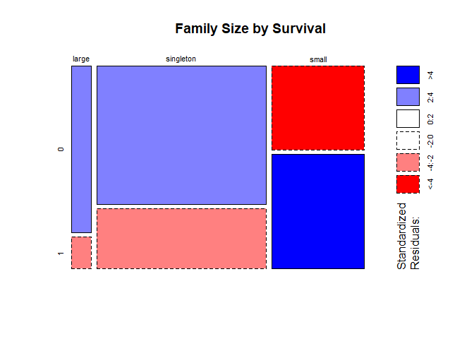
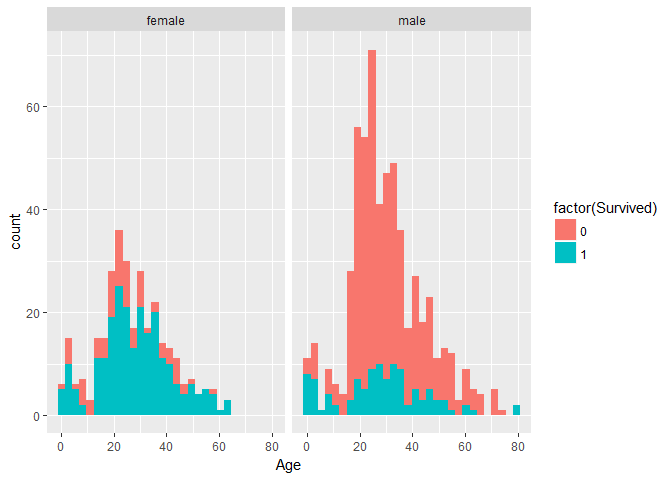
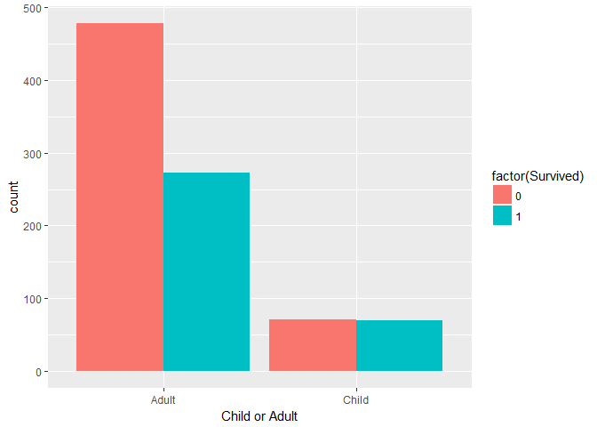
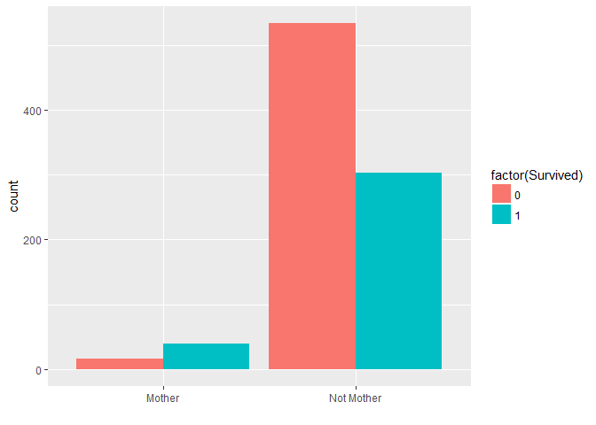
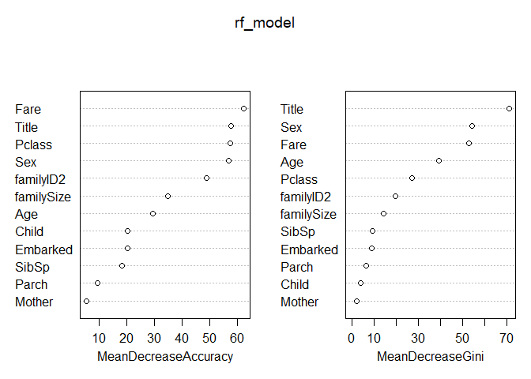

Titanic Survival EDA
================
Nishikant Sinha
January 29, 2018

### Exploring Survival on Titanic

Here goes the Titanic Survival End to End ML Pipeline

#### 1. Introduction

        1.1 Load Packages
        1.2 Load Data
        1.3 Run Statistical Summeries

#### 2. Missing Value Imputation

        2.1 Figure out missing value
        2.2 Sensible Imputation
        2.3 Predictive Imputation

#### 3. Feature Engineering

        3.1 Extract Title and Surname from Name
        3.2 Calculate Family Size
        3.3 Identify the real families
        3.4 Visualizations
        3.5 Treat few more vaiables
        3.6 Factoring and Scaling Variable

#### 4. Prediction and Submission

        4.1 Split data into train and test
        4.2 Build First Classification Model ( i.e. Logistic Regression)
        4.3 Naive Base Model
        4.4 Support Vector Machine
        4.5 Decision Trees
        4.6 Random Forest
        4.7 Conditional Random Forest

#### 5. Conclusion

------------------------------------------------------------------------

#### 1 Introduction

Hi Folks! The purpose of this notebook is to demonstrate the complete cycle of any EDA and predictive model implementation.

Here we will be focusing on loading data, cleaning data, missing data imputation, basic visualization and predictive model building for predicting survivals on Titanic. I am new to machine learning, so please correct me if there are any mistakes, feedback and suggestion will be highly appreciated. Now let's begin our journey of exploaring Titanic Survival.

##### 1.1 Load Packages

``` r
#Disable warnings
options(warn=-1)

# Load Packages
library(tidyverse)     # collection of libraries like readr, dplyr, ggplot
library(rpart)         # classification algorithm
library(mice)          # imputation
library(scales)        # Visualization
library(ggthemes)      # Visualization
library(class)         # classification algorithm
library(e1071)         # classification algorithm
library(randomForest)  # classification algorithm
library(party)         # classification algorithm
```

##### 1.2 Load Train and Test data

``` r
# Read datasets
train <- read_csv("./datasets/train.csv")  # Load train data
test <- read_csv("./datasets/test.csv")    # Load test data
full <- bind_rows(train,test)     # combine training and test dataset
```

##### 1.3 Run Statistical Summaries

Let's have a quick look to our dataset.

``` r
head(full,10)  # View few records of loaded data
```

    ## # A tibble: 10 x 12
    ##    PassengerId Survived Pclass Name   Sex     Age SibSp Parch Ticket  Fare
    ##          <int>    <int>  <int> <chr>  <chr> <dbl> <int> <int> <chr>  <dbl>
    ##  1           1        0      3 Braun~ male     22     1     0 A/5 2~  7.25
    ##  2           2        1      1 Cumin~ fema~    38     1     0 PC 17~ 71.3 
    ##  3           3        1      3 Heikk~ fema~    26     0     0 STON/~  7.92
    ##  4           4        1      1 Futre~ fema~    35     1     0 113803 53.1 
    ##  5           5        0      3 Allen~ male     35     0     0 373450  8.05
    ##  6           6        0      3 Moran~ male     NA     0     0 330877  8.46
    ##  7           7        0      1 McCar~ male     54     0     0 17463  51.9 
    ##  8           8        0      3 Palss~ male      2     3     1 349909 21.1 
    ##  9           9        1      3 Johns~ fema~    27     0     2 347742 11.1 
    ## 10          10        1      2 Nasse~ fema~    14     1     0 237736 30.1 
    ## # ... with 2 more variables: Cabin <chr>, Embarked <chr>

It seems that everything worked well till here and our data file is loaded properly. Now let's see how many variables are there, what are there types and how many number of records are present. These can be easily known by R inbuilt function str().

``` r
# Check Structure of data set
str(full)
```

    ## Classes 'tbl_df', 'tbl' and 'data.frame':    1309 obs. of  12 variables:
    ##  $ PassengerId: int  1 2 3 4 5 6 7 8 9 10 ...
    ##  $ Survived   : int  0 1 1 1 0 0 0 0 1 1 ...
    ##  $ Pclass     : int  3 1 3 1 3 3 1 3 3 2 ...
    ##  $ Name       : chr  "Braund, Mr. Owen Harris" "Cumings, Mrs. John Bradley (Florence Briggs Thayer)" "Heikkinen, Miss. Laina" "Futrelle, Mrs. Jacques Heath (Lily May Peel)" ...
    ##  $ Sex        : chr  "male" "female" "female" "female" ...
    ##  $ Age        : num  22 38 26 35 35 NA 54 2 27 14 ...
    ##  $ SibSp      : int  1 1 0 1 0 0 0 3 0 1 ...
    ##  $ Parch      : int  0 0 0 0 0 0 0 1 2 0 ...
    ##  $ Ticket     : chr  "A/5 21171" "PC 17599" "STON/O2. 3101282" "113803" ...
    ##  $ Fare       : num  7.25 71.28 7.92 53.1 8.05 ...
    ##  $ Cabin      : chr  NA "C85" NA "C123" ...
    ##  $ Embarked   : chr  "S" "C" "S" "S" ...

We have got some sense of our variable, their class type, first few observations of each. Now we know that we are working with 12 variables and 1309 observations. Though these are very basic information about our dataset but these are of great use for further analysis.

#### 2 Missing Value Imputation

The next and impotant part of any EDA is data cleaning. It's first and foremost step is to check for missing values in dataset. So let's see how many missing values each variable is have.

``` r
# Apply sum(is.na()) to each variable to check missing values
# sapply() is used to apply a function to each element of list, dataframes or vectors.
sapply(full, function(x) sum(is.na(x))) 
```

    ## PassengerId    Survived      Pclass        Name         Sex         Age 
    ##           0         418           0           0           0         263 
    ##       SibSp       Parch      Ticket        Fare       Cabin    Embarked 
    ##           0           0           0           1        1014           2

There are 5 variables which have missing values i.e Survived, Age, Fare, Cabin and Embarked. Among these Survived variable doesn't need any treatment as we have to predict its value using machine learning predictive models, we will not impute the Cabin variable as it has too much sparseness. The variables which need to be treated are Age, Fare, and Embarked.

##### 2.1 Sensible Value Imputation

So first let's begin Sensible Value Imputation process with Fare variable as it has only 1 missing value so sensible value imputation will be a good option for this.

``` r
# Find which observation has missing fare value
which(is.na(full$Fare)==TRUE)   # which() will return indexes of the observation which has missing value for Fare
```

    ## [1] 1044

``` r
# 1044 is the index of missing fare value

full[1044,]   # View complete information of obbseravation which has missing Fare value
```

    ## # A tibble: 1 x 12
    ##   PassengerId Survived Pclass Name    Sex     Age SibSp Parch Ticket  Fare
    ##         <int>    <int>  <int> <chr>   <chr> <dbl> <int> <int> <chr>  <dbl>
    ## 1        1044       NA      3 Storey~ male   60.5     0     0 3701      NA
    ## # ... with 2 more variables: Cabin <chr>, Embarked <chr>

The Passenger which has missing fare value belongs to class 3 and departed from Southampton(S), so we are going to visualize the fares distribution among the passengers sharing the same class and embarkment. We will use ggplot which is one of the most powerful visualization tool in R.

``` r
# Set the height and weight of the plot
options(repr.plot.width=6, repr.plot.height=4)

# Plot Fare distrfibution of class 3 passenger who embarked from port S
ggplot(full[full$Pclass == '3' & full$Embarked == 'S',], aes(x = Fare)) +   
  geom_density(fill = 'royalblue', alpha ='0.7') +
  geom_vline(aes(xintercept=median(Fare, na.rm=T)), colour='red', linetype='dashed', lwd=1) +
  scale_x_continuous(labels=dollar)
```


From this visualization it seems quite sensible to replace the missing fare value with median fare of class 3 passengers whose embarkment port was 'S'.

``` r
# Replace missing fare with median fare for class and embarkment.
full$Fare[1044] <- median(full[full$Pclass == 3 & full$Embarked == 'S', ]$Fare,na.rm = TRUE)
```

Next we are going to impute the missing Embarkment port. First let's see the which 2 passenger has missing embarkment port, also check their complete information.

``` r
# Find which observation has missing Embarkation value
which(is.na(full$Embarked)==TRUE)
```

    ## [1]  62 830

``` r
# Passengers with IDs 62 and 830 has missing embarkation value

# View complete information of passengers with ID 62 and 830
full[c(62,830),]
```

    ## # A tibble: 2 x 12
    ##   PassengerId Survived Pclass Name    Sex     Age SibSp Parch Ticket  Fare
    ##         <int>    <int>  <int> <chr>   <chr> <dbl> <int> <int> <chr>  <dbl>
    ## 1          62        1      1 Icard,~ fema~    38     0     0 113572    80
    ## 2         830        1      1 Stone,~ fema~    62     0     0 113572    80
    ## # ... with 2 more variables: Cabin <chr>, Embarked <chr>

From this information it seems clear that there are 2 significant similarities between these two passengers i.e. both belongs to class 1 and have paid $80 as fare. So we can visualize the port of embarkation sharing similar information.

``` r
# Before visualization get rid of passenger Ids 62 and 830 having missing embarkment port
plot_data <- full[-c(62,830),]

# Use ggplot2 to visualize embarkment, passenger class, & median fare
ggplot(plot_data, aes(x = Embarked, y = Fare, fill = factor(Pclass))) +
  geom_boxplot() +
  geom_hline(aes(yintercept=80), colour='red', linetype='dashed', lwd=2) +
  scale_y_continuous(labels=dollar)
```



This visualization gives a clear picture of the median fare for a first class passenger departing from Charbourg ('C') which coincides nicely with the $80 paid by our embarkment-deficient passengers. So the missing embarkement values can be replaced by 'C'.

``` r
# Replace NAs in Embarked with 'C'
full$Embarked[c(62,830)] <- 'C'
```

##### 2.3 Predictive Value Imputation

Now we will be dealing with Age variable imputation as this variable has 263 missing which will be quite inaccurate to impute sensibly, thus we will use Predictive imputation. For this there are several approach that we can follow but in this notebook we will see only two methods the first one is rpart (recursive partitioning for regression) and more fancy method which is mice (multivariate imputation by chained equation)

``` r
# Convert categorical variable into factors
factor_vars <- c('Pclass','Sex','Embarked')
full[factor_vars] <- lapply(full[factor_vars], function(x) as.factor(x))
```

``` r
# Set a random seed
set.seed(129)

# Build rpart model for age imputation 
age_pred <- rpart(Age ~ Pclass + Sex + SibSp + Parch + Fare + Embarked,
                  data = full[!is.na(full$Age),], method = "anova") 

# Use the rpart model to predict the missing age values
imputed_age <- predict(age_pred, full[is.na(full$Age),])
rpart_imputation <- full
missing_age_indexes <- which(is.na(full$Age)==TRUE)
rpart_imputation$Age[missing_age_indexes] <- imputed_age
```

``` r
# Perform mice imputation, excluding certain less-than-useful variables:
mice_mod <- mice(full[, !names(full) %in% c('PassengerId','Name','Ticket','Cabin','Survived')],
                 method='rf') 
```

    ## 
    ##  iter imp variable
    ##   1   1  Age
    ##   1   2  Age
    ##   1   3  Age
    ##   1   4  Age
    ##   1   5  Age
    ##   2   1  Age
    ##   2   2  Age
    ##   2   3  Age
    ##   2   4  Age
    ##   2   5  Age
    ##   3   1  Age
    ##   3   2  Age
    ##   3   3  Age
    ##   3   4  Age
    ##   3   5  Age
    ##   4   1  Age
    ##   4   2  Age
    ##   4   3  Age
    ##   4   4  Age
    ##   4   5  Age
    ##   5   1  Age
    ##   5   2  Age
    ##   5   3  Age
    ##   5   4  Age
    ##   5   5  Age

``` r
# Save the complete output 
mice_output <- complete(mice_mod)
```

``` r
# Plot age distributions
par(mfrow=c(1,3))
hist(full$Age, freq=F, xlab ='Passengers Age',main='Age: Original Data', 
     col='turquoise4', ylim=c(0,0.06))
lines(density(full$Age,na.rm = TRUE), col="red2", lwd=1.5)

hist(rpart_imputation$Age, freq=F, xlab ='Passengers Age', main='Age: Rpart Output', 
     col='turquoise3', ylim=c(0,0.06))
lines(density(rpart_imputation$Age), col="red2", lwd=1.5)

hist(mice_output$Age, freq=F, xlab ='Passengers Age', main='Age: MICE Output', 
     col='turquoise1', ylim=c(0,0.06))
lines(density(mice_output$Age), col="red2", lwd=1.5)
```



The above visualization makes it clear that MICE imputation has performed better than rpart as it gives more similar distribution with respect to original distribution.

``` r
# Replace Age variable from the mice model.
full$Age <- mice_output$Age

# Check if missing Age values got replaced 
sum(is.na(full$Age))
```

    ## [1] 0

#### 3 Feature Engineering

The next part of this EDA is about doing some feature engineering (Feature engineering is the process of transforming raw data into features that better represent the underlying problem to the predictive models, resulting in improved model accuracy on unseen data) with our dataset.

##### 3.1 Extract Title and Surname from Name

Here the most obvious attention seeker of feature engineering is Name variable as it contains alot of things which can be useful for our machine learning model building. We can break it down into additional meaningful variables which can feed predictions or be used in the creation of additional new variables.

``` r
# Extract title from passengers name
full$Title <- gsub('(.*, )|(\\..*)', '', full$Name) 
# gsub() function replaces all matches of a string, if the parameter is a string vector, returns a string vector of the same length and with the same attributes
```

``` r
# Show title counts by sex
table(full$Sex, full$Title)
```

    ##         
    ##          Capt Col Don Dona  Dr Jonkheer Lady Major Master Miss Mlle Mme
    ##   female    0   0   0    1   1        0    1     0      0  260    2   1
    ##   male      1   4   1    0   7        1    0     2     61    0    0   0
    ##         
    ##           Mr Mrs  Ms Rev Sir the Countess
    ##   female   0 197   2   0   0            1
    ##   male   757   0   0   8   1            0

``` r
# Titles with very low cell counts to be combined to "rare" level
rare_title <- c('Dona', 'Lady', 'the Countess','Capt', 'Col', 'Don', 
                'Dr', 'Major', 'Rev', 'Sir', 'Jonkheer')

# Also reassign mlle, ms, and mme accordingly
full$Title[full$Title == 'Mlle']        <- 'Miss' 
full$Title[full$Title == 'Ms']          <- 'Miss'
full$Title[full$Title == 'Mme']         <- 'Mrs' 
full$Title[full$Title %in% rare_title]  <- 'Rare Title'

# Show title counts by sex again
table(full$Sex, full$Title)
```

    ##         
    ##          Master Miss  Mr Mrs Rare Title
    ##   female      0  264   0 198          4
    ##   male       61    0 757   0         25

Alright! We are done with passenger's Tilte now. What else can we think up? Well we could try extracting the Surname of passengers and group them to find families.

``` r
# Extract surname from name variable
full$Surname <- sapply(full$Name, function(x) {strsplit(x, split = '[,.]')[[1]][1]})

# Check the number of unique Surnames
cat(paste('We have ', nlevels(factor(full$Surname)), ' unique surnames.'))
```

    ## We have  875  unique surnames.

But a common last name such as Johnson might have a few extra non-related people aboard. In fact there are three Johnsons in a family with size 3, and another three probably unrelated Johnsons all travelling solo.

Combining the Surname with the family size though should remedy this concern. So let's extract the passengers' family size.

##### 3.2 Calculate Family Size

Pretty simple! We just add the number of siblings, spouses, parents and children the passenger had with them, and plus one for their own existence of course, and have a new variable indicating the size of the family they travelled with.

``` r
# Add familySize variable to our dataset
full$familySize <- full$SibSp + full$Parch + 1
```

##### 3.3 Identify the real family

We then want to append the FamilySize variable to the front of Surname, but as we saw with factors, string operations need strings. So let's convert the FamilySize variable temporarily to a string and combine it with the Surname to get our new FamilyID variable:

``` r
# Combine familySize and Surname to make familyID 
full$familyID <- paste(as.character(full$familySize), full$Surname, sep = "")

#full$familyID[full$familySize == 1] <- 'Singleton'
full$familyID[full$familySize <= 2] <- 'Small'

# View the count of each category of familyID
table(full$familyID)
```

    ## 
    ##            11Sage           3Abbott         3Appleton         3Beckwith 
    ##                11                 3                 1                 2 
    ##           3Boulos           3Bourke            3Brown         3Caldwell 
    ##                 3                 3                 4                 3 
    ##          3Christy          3Collyer          3Compton          3Cornell 
    ##                 2                 3                 3                 1 
    ##           3Coutts           3Crosby           3Danbom           3Davies 
    ##                 3                 3                 3                 5 
    ##            3Dodge          3Douglas             3Drew            3Elias 
    ##                 3                 1                 3                 3 
    ##       3Frauenthal        3Frolicher 3Frolicher-Stehli        3Goldsmith 
    ##                 1                 1                 2                 3 
    ##       3Gustafsson       3Hamalainen           3Hansen             3Hart 
    ##                 2                 2                 1                 3 
    ##             3Hays          3Hickman         3Hiltunen         3Hirvonen 
    ##                 2                 3                 1                 1 
    ##         3Jefferys          3Johnson             3Kink    3Kink-Heilmann 
    ##                 2                 3                 2                 2 
    ##           3Klasen         3Lahtinen           3Mallet            3McCoy 
    ##                 3                 2                 3                 3 
    ##          3Minahan         3Moubarek            3Nakid         3Navratil 
    ##                 1                 3                 3                 3 
    ##           3Newell           3Newsom         3Nicholls          3Peacock 
    ##                 1                 1                 1                 3 
    ##            3Peter            3Quick         3Richards          3Rosblom 
    ##                 3                 3                 2                 3 
    ##           3Samaan        3Sandstrom           3Silven          3Spedden 
    ##                 3                 3                 1                 3 
    ##            3Strom          3Taussig           3Thayer           3Thomas 
    ##                 1                 3                 3                 1 
    ##            3Touma     3van Billiard         3Van Impe    3Vander Planke 
    ##                 3                 3                 3                 2 
    ##            3Wells             3Wick          3Widener          4Allison 
    ##                 3                 3                 3                 4 
    ##        4Backstrom          4Baclini           4Becker           4Carter 
    ##                 1                 4                 4                 4 
    ##         4Davidson             4Dean           4Herman          4Hocking 
    ##                 1                 4                 4                 2 
    ##        4Jacobsohn         4Johnston          4Laroche           4Renouf 
    ##                 1                 4                 4                 1 
    ##    4Vander Planke             4West             5Ford          5Hocking 
    ##                 1                 4                 5                 1 
    ##    5Kink-Heilmann          5Lefebre          5Palsson          5Ryerson 
    ##                 1                 5                 5                 5 
    ##          6Fortune           6Panula             6Rice         6Richards 
    ##                 6                 6                 6                 1 
    ##            6Skoog        7Andersson          7Asplund          8Goodwin 
    ##                 6                 9                 7                 8 
    ##             Small 
    ##              1025

Hmm, a few seemed to have slipped through the cracks here. There's plenty of FamilyIDs with only one or two members, even though we wanted only family sizes of 3 or more. Perhaps some families had different last names, but whatever the case, all these one or two people groups is what we sought to avoid with the three person cut-off. Let's begin to clean this up:

``` r
# Create a data frame having count of each category
fmlyIDs <- data.frame(table(full$familyID))

# Get the familyID which have count less than 3
smallFamId <- fmlyIDs[fmlyIDs$Freq <=2,]

# Replace the familyID which have count less than  3 with 'Small'
full$familyID[full$familyID %in% smallFamId$Var1] <- 'Small'

# Again check the count of each category of familyID
table(full$familyID)
```

    ## 
    ##        11Sage       3Abbott       3Boulos       3Bourke        3Brown 
    ##            11             3             3             3             4 
    ##     3Caldwell      3Collyer      3Compton       3Coutts       3Crosby 
    ##             3             3             3             3             3 
    ##       3Danbom       3Davies        3Dodge         3Drew        3Elias 
    ##             3             5             3             3             3 
    ##    3Goldsmith         3Hart      3Hickman      3Johnson       3Klasen 
    ##             3             3             3             3             3 
    ##       3Mallet        3McCoy     3Moubarek        3Nakid     3Navratil 
    ##             3             3             3             3             3 
    ##      3Peacock        3Peter        3Quick      3Rosblom       3Samaan 
    ##             3             3             3             3             3 
    ##    3Sandstrom      3Spedden      3Taussig       3Thayer        3Touma 
    ##             3             3             3             3             3 
    ## 3van Billiard     3Van Impe        3Wells         3Wick      3Widener 
    ##             3             3             3             3             3 
    ##      4Allison      4Baclini       4Becker       4Carter         4Dean 
    ##             4             4             4             4             4 
    ##       4Herman     4Johnston      4Laroche         4West         5Ford 
    ##             4             4             4             4             5 
    ##      5Lefebre      5Palsson      5Ryerson      6Fortune       6Panula 
    ##             5             5             5             6             6 
    ##         6Rice        6Skoog    7Andersson      7Asplund      8Goodwin 
    ##             6             6             9             7             8 
    ##         Small 
    ##          1074

##### 3.4 Visualization

What does our family size variable look like? To help us understand how it may relate to survival, let's plot it among the training data.

``` r
# Use ggplot2 to visualize the relationship between family size & survival
ggplot(full[1:891,], aes(x = familySize, fill = factor(Survived))) +
  geom_bar(stat='count', position='dodge') +
  scale_x_continuous(breaks=c(1:11)) +
  labs(x = 'Family Size')
```



Ah hah. We can see that there's a survival penalty to singletons and those with family sizes above 4. We can collapse this variable into three levels which will be helpful since there are comparatively fewer large families. Let's create a discretized family size variable.

``` r
# Discretize family size
full$familySize[full$familySize > 4] <- 'large'
full$familySize[full$familySize == 1] <- 'singleton'
full$familySize[full$familySize < 5 & full$familySize > 1] <- 'small'

# Show family size by survival using a mosaic plot
mosaicplot(table(full$familySize, full$Survived), main='Family Size by Survival', shade=TRUE)
```



The mosaic plot shows that we preserve our rule that there's a survival penalty among singletons and large families, but a benefit for passengers in small families.

Now let's visualize the relationship between Age, Sex and Survival, to check which age and sex group is having highest death penalty

``` r
# First we'll look at the relationship between age, sex & survival
ggplot(full[1:891,], aes(Age, fill = factor(Survived))) + 
  geom_histogram() + 
  facet_grid(.~Sex)
```

    ## `stat_bin()` using `bins = 30`. Pick better value with `binwidth`.



This visualization gives a clear idea that there is Survival penalty to men.

##### 3.5 Treat Few more variables

Since the Random Forests in R can only digest factors with up to 32 levels. Our FamilyID variable had almost double that. We could take two paths forward here, either change these levels to their underlying integers (using the unclass() function) and having the tree treat them as continuous variables, or manually reduce the number of levels to keep it under the threshold.

Let's take the second approach. To do this we'll copy the familyID column to a new variable, familyID2, and then convert it from a factor back into a character string with as.character(). We can then increase our cut-off to be a "Small" family from 2 to 3 people. Then we just convert it back to a factor and we're done:

``` r
# Copy the familyID to new variable familyID2
full$familyID2 <- full$familyID

# Covert to string
full$familyID2 <- as.character(full$familyID2)

# Create data frame having count of each familyID
fmlyIDs <- data.frame(table(full$familyID2))

# find the family ID having count equal to 3
smallFamId <- fmlyIDs[fmlyIDs$Freq ==3,]

# Replace the familyID having count 3 with 'Small'
full$familyID2[full$familyID %in% smallFamId$Var1] <- 'Small'

# Check the familyID2 variable
table(full$familyID2)
```

    ## 
    ##     11Sage     3Brown    3Davies   4Allison   4Baclini    4Becker 
    ##         11          4          5          4          4          4 
    ##    4Carter      4Dean    4Herman  4Johnston   4Laroche      4West 
    ##          4          4          4          4          4          4 
    ##      5Ford   5Lefebre   5Palsson   5Ryerson   6Fortune    6Panula 
    ##          5          5          5          5          6          6 
    ##      6Rice     6Skoog 7Andersson   7Asplund   8Goodwin      Small 
    ##          6          6          9          7          8       1185

Now that we know everyone's age, we can create a couple of new age-dependent variables: Child and Mother. A child will simply be someone under 18 years of age and a mother is a passenger who is 1) female, 2) is over 18, 3) has more than 0 children (no kidding!), and 4) does not have the title 'Miss'. Let's find out how many children were there on Titanic and what is there survival ratio.

``` r
# First create the child variable and indicate whether child or adult
full$Child <- 'Adult'
full$Child[full$Age < 18] <- 'Child'

# Show the count 
table(full$Child, full$Survived)
```

    ##        
    ##           0   1
    ##   Adult 478 273
    ##   Child  71  69

``` r
# Use ggplot2 to visualize the relationship between being a child & survival
ggplot(as.data.frame(full[1:891,]), aes(x = Child, fill = factor(Survived))) +
geom_bar(position = "dodge") +
labs(x = 'Child or Adult')
```



Looks like being a child doesn't hurt, but it's not going to necessarily save you either! We will finish off our feature engineering by creating the Mother variable. Maybe we can hope that mothers are more likely to have survived on the Titanic.

``` r
# Adding Mother variable 
full$Mother <- 'Not Mother'
full$Mother[full$Sex == 'female'  & full$Parch >0 & full$Age >= 18 & full$Title != 'Miss'] <- 'Mother'

# Show the count of mothers survival
table(full$Mother, full$Survived)
```

    ##             
    ##                0   1
    ##   Mother      16  39
    ##   Not Mother 533 303

``` r
# Use ggplot2 to visualize the relationship between being a child & survival
ggplot(as.data.frame(full[1:891,]), aes(x = Mother, fill = factor(Survived))) +
  geom_bar(position = "dodge") +
  labs(x = '') 
```



Well this proves that our assumption was correct and Mothers are more likely to survive Titanic.

##### 3.6 Factoring and Scaling Variable

Our final steps of feature engineering are to scale the continuos variable and convert categorical variables to factor that we have created.

``` r
# Scaling of continuos variable
full[,c(6,10)] <- scale(full[,c(6,10)])
# Finish by factorizing our categorical variables
full$Title <- factor(full$Title)
full$Surname <- factor(full$Surname)
full$familySize <- factor(full$familySize)
full$familyID <- factor(full$familyID)
full$familyID2 <- factor(full$familyID2)
full$Child  <- factor(full$Child)
full$Mother <- factor(full$Mother)
```

#### 4 Prediction and Submission

##### 4.1 Split data into Train and Test dateset

We are now ready to split the test and training sets back into their original states, carrying our fancy new engineered variables with them.

So let's break them apart and do some predictions on our new fancy engineered variables:

``` r
train <- full[1:891,]
test <- full[892:1309,]
```

##### 4.2 Build First Predictive model (i.e. Logistic Regression)

Time to do our predictions! The first binary classifier which will be using to predict survival is Logistic Regression. So let's begin the model bulding.

``` r
# build the model using all the important feature
glm_model <- glm(data = train, formula = Survived ~ Pclass + Sex + Age + SibSp + Parch + Fare + Embarked 
+ Title + familySize + familyID2 + Child + Mother,
family = binomial(link = "logit"))

# Print annova (analysis of variance) table, this will give you variance and df of each vriable
anova(glm_model)
```

    ## Analysis of Deviance Table
    ## 
    ## Model: binomial, link: logit
    ## 
    ## Response: Survived
    ## 
    ## Terms added sequentially (first to last)
    ## 
    ## 
    ##            Df Deviance Resid. Df Resid. Dev
    ## NULL                         890    1186.66
    ## Pclass      2  103.547       888    1083.11
    ## Sex         1  256.220       887     826.89
    ## Age         1   17.049       886     809.84
    ## SibSp       1   15.135       885     794.70
    ## Parch       1    0.363       884     794.34
    ## Fare        1    1.471       883     792.87
    ## Embarked    2    3.201       881     789.67
    ## Title       4   61.098       877     728.57
    ## familySize  2   13.628       875     714.94
    ## familyID2  23   47.963       852     666.98
    ## Child       1    0.391       851     666.59
    ## Mother      1    0.049       850     666.54

``` r
# Check the summary of the model, it will have residual and null diviance by which we can calculate pseudo R^2 
# summary(glm_model)
```

Wow! we have successfully built our first binary classifier. Now its time to evaluate our model with both train and test dataset.

``` r
# Create confusion matrix with train data set to check its accuracy in trainig environment
Prediction <- predict(glm_model, train[,-2], type = "response")
confusion_matrix_train <- table(train$Survived, (Prediction > 0.5))  
#  > 0.5 signifies that whatever comes greater than .5 will be considered 1 in confusion matrix

print(confusion_matrix_train)
```

    ##    
    ##     FALSE TRUE
    ##   0   488   61
    ##   1    82  260

``` r
# Calculate Precision and Recall based on the confusion matrix 
recall <- 260/(260+82)     # recall = True Positive(TP) / Actual Yes
# 0.7602339

precision <- 260/(260+61)   # precision = TP / Predicited Yes
# 0.8099688

# calculate the f1 score (measure of accuracy)
f1 <- (2*recall*precision)/(recall+precision)
print(paste0("Accuracy : ",f1))
```

    ## [1] "Accuracy : 0.784313725490196"

``` r
# Calculate pseudo R^2
psr <- 1 - (664.96/1186.7) # psr = 1 - (residual deviance / null deviance)

# Print  the value of pseudo R-square 
print(psr)
```

    ## [1] 0.4396562

``` r
#This Logistic Regression model has Psuedo R-square of 0.4396562
```

It seems that our model is having pretty good accuracy of 0.784314 with train dataset, now let's check whether it has similar accuracy with our test dataset as well or is a case of overfitting.

``` r
# Do same prediction on test data set
Prediction <- predict(glm_model, test[,-2], type = "response")
Prediction <- as.integer(Prediction > 0.5)
```

``` r
# Create data frame having 2 columns PassengerId and Survived as in sample submission of this competition
submit <- data.frame(PassengerId = test$PassengerId, Survived = Prediction)

# Write the data frame to a .csv file(in Rstudio)  and submit the file to kaggle 
write.csv(submit, file = "glm_model.csv", row.names = FALSE)
```

On submission on Kaggle I have got accuracy as 0.77990 which is similar to our accuracy with train dataset, so the Logistic Regression model is performing quite well with test dataset also.

#### 4.3 Naive Bayes

Well everything till now is perfect, next we have to build the remiaining binary classifier and repeat the same steps for evaluating our model.

So now its time to build our second model i.e. Naive Bayes model

``` r
# Create Naive Bayes model using naiveBayes function
nb_model <- naiveBayes(as.factor(Survived) ~ Pclass + Sex + Age + SibSp + Parch + Fare + Embarked 
+ Title + familySize + familyID2 + Child + Mother,
data = train)
# Check summary of model
summary(nb_model)
```

    ##         Length Class  Mode     
    ## apriori  2     table  numeric  
    ## tables  12     -none- list     
    ## levels   2     -none- character
    ## call     4     -none- call

Great our model building is done now its evaluation time, repeat the same steps as done for Logistic Regression model

``` r
#Creating confusion matrix for the model
train_pred <- predict(nb_model, train)
confusion_matrix_train <- table(train$Survived, train_pred)

print(confusion_matrix_train)
```

    ##    train_pred
    ##       0   1
    ##   0 470  79
    ##   1  85 257

``` r
#Calculating Precision and recall
recall <- 256/(256+86)     # recall = TP / actual yes
# 0.748538

precision <- 256/(256+79)   # precision = TP / predicted yes
# 0.7641791

f1 <- (2*recall*precision)/(recall+precision)
print(paste0("Accuracy : ",f1))
```

    ## [1] "Accuracy : 0.756277695716396"

It seems that our Logistic Regression model performs better with train dataset, let's check whether this apllies to test dataset or not.

Do same prediction on test data set and submit the result on Kaggle

``` r
#Do same prediction on test data set
test_pred <- predict(nb_model, test)
submit <- data.frame(PassengerId = test$PassengerId, Survived = test_pred)
```

On submitting our result of Naive Bayes model I got accuracy of 0.76076, so till now Logistic Regression is leading and there is no case of overfitting in both the models.

##### 4.4 Support Vector Machine

Now let's move to our third binary classifier i.e. Support Vector Machine

``` r
# Build model using function svm()
sv_model <- svm(as.factor(Survived) ~ Pclass + Sex + Age + SibSp + Parch + Fare + Embarked + Title 
                + familySize + familyID2 + Child + Mother,
                train[,-c(11)])
# Note always take care of the variable which have missing values for svm because if any row is having 
# missing feature then it will not give output for that particular observation
# That's why I have excluded the Cabin variable which is having missing values

# Check the information like gamma value, number of support vectors of the model built 
print(sv_model)
```

    ## 
    ## Call:
    ## svm(formula = as.factor(Survived) ~ Pclass + Sex + Age + SibSp + 
    ##     Parch + Fare + Embarked + Title + familySize + familyID2 + 
    ##     Child + Mother, data = train[, -c(11)])
    ## 
    ## 
    ## Parameters:
    ##    SVM-Type:  C-classification 
    ##  SVM-Kernel:  radial 
    ##        cost:  1 
    ##       gamma:  0.02439024 
    ## 
    ## Number of Support Vectors:  422

Let's begin evaluating our Support Vector Machine model with train dataset.

``` r
#Creating confusion matrix for the model
train_pred <- predict(sv_model, train[,-c(11)])
confusion_matrix_train <- table(train$Survived, train_pred)

print(confusion_matrix_train)
```

    ##    train_pred
    ##       0   1
    ##   0 492  57
    ##   1  89 253

``` r
#Calculating Precision and recall
recall <- 252/(252+90)     # recall = TP / actual yes
# 0.7368421

precision <- 252/(252+58)   # precision = TP / predicted yes
# 0.8129032

f1 <- (2*recall*precision)/(recall+precision)
print(paste0("Accuracy : ",f1))
```

    ## [1] "Accuracy : 0.773006134969325"

Now it's time to submit result of our third binary classifier and check result.

``` r
#Do same prediction on test data set
test_pred <- predict(sv_model, test[,-c(2,11)])
submit <- data.frame(PassengerId = test$PassengerId, Survived = test_pred)
```

Woohoo! This time we have got 0.78947 accuracy score which highest among all.

##### 4.5 Decision Trees

Our next binary classifier is Decision Trees which we have already used for imputing Age variable, so let's implement Decision Tree model for predicting survival on Titanic.

``` r
# set seed
set.seed(415)

# Create model using rpart() function
dt_model <- rpart(Survived ~ Pclass + Sex + Age + SibSp + Parch + Fare + Embarked + Title + familySize 
+ familyID + Child + Mother,
data = train,
method = "class")
# Now it's time to evaluate our Decision Tree binary classifier.

#Creating confusion matrix for the model
train_pred <- predict(dt_model, train, type = "class")
confusion_matrix_train <- table(train$Survived, train_pred)

print(confusion_matrix_train)
```

    ##    train_pred
    ##       0   1
    ##   0 502  47
    ##   1  91 251

``` r
#Calculating Precision and recall
recall <- 251/(251+91)     # recall = TP / actual yes
# 0.7426901

precision <- 251/(251+47)   # precision = TP / predicted yes
# 0.8141026

f1 <- (2*recall*precision)/(recall+precision)
print(paste0("Accuracy : ",f1))
```

    ## [1] "Accuracy : 0.784375"

Great! Our Decision tree model turned into best model till now in terms of accuracy with training dataset, let's check whether it can give similar result with test dataset or not.

``` r
Prediction <- predict(dt_model, test, type = "class")
submit <- data.frame(PassengerId = test$PassengerId, Survived = Prediction)
```

Wow! it seems that our Decision tree model has defeated Support Vector machine model in terms of accuracy with both train and test dataset.

##### 4.6 Random Forest

Now let's move to our next binary classifier which is Random Forest and it is considered as extention of decision trees as it has more than one tree. Time to begin our next hunt for best model.

``` r
# set seed
set.seed(415)

# Build the model (note: not all possible variables are used)
rf_model <- randomForest(as.factor(Survived) ~ Pclass + Sex + Age + SibSp + Parch + Fare + Embarked 
                         + Title + familySize + familyID2 + Child + Mother,
                         data=train,
                         importance=TRUE,
                         ntree=2000)

# So let's look at what variables were important:
varImpPlot(rf_model)
```



There's two types of importance measures shown above i.e. MeanDecreaseAccuracy and MeanDecreaseGini.

The accuracy one tests to see how worse the model performs without each variable, so a high decrease in accuracy would be expected for very predictive variables.

The Gini one digs into the mathematics behind decision trees, but essentially measures how pure the nodes are at the end of the tree. Again it tests to see the result if each variable is taken out and a high score means the variable was important.

Unsurprisingly, our Title variable was at the top for Gini measures. We should be pretty happy to see that the remaining engineered variables are doing quite nicely too.

Now Let's perform the evaluation on train dataset using Random Forest model.

``` r
#Creating confusion matrix for the model
train_pred <- predict(rf_model, train)
confusion_matrix_train <- table(train$Survived, train_pred)

print(confusion_matrix_train)
```

    ##    train_pred
    ##       0   1
    ##   0 533  16
    ##   1  66 276

``` r
#Calculating Precision and recall
recall <- 280/(280+62)     # recall = TP / actual yes
# 0.8187134

precision <- 280/(280+17)   # precision = TP / predicted yes
# 0.9427609

f1 <- (2*recall*precision)/(recall+precision)
print(paste0("Accuracy : ",f1))
```

    ## [1] "Accuracy : 0.876369327073553"

Amazing! We have got a very nice accuracy score of 0.8763693 with train dataset using Random Forest, now let's see it's performance with train dataset.

``` r
Prediction <- predict(rf_model, test, type = "class")
submit <- data.frame(PassengerId = test$PassengerId, Survived = Prediction)
```

Unfortunately on submission we have got very less accuracy score i.e. 0.77033 which makes it clear that it is a case of overfitting.

But let's not give up yet. There's more than one ensemble model. Let's try a forest of conditional inference trees. They make their decisions in slightly different ways, using a statistical test rather than a purity measure, but the basic construction of each tree is fairly similar.

##### 4.7 Conditional Random Forest

Conditional inference trees are able to handle factors with more levels than Random Forests can, so let's go back to out original version of FamilyID.

So go ahead and build the Conditional Random Forest model.

``` r
# We again set the seed for consistent results and build a model in a similar way to our Random Forest
set.seed(415)

cf_model <- cforest(as.factor(Survived) ~ Pclass + Sex + Age + SibSp + Parch + Fare + Embarked + Title 
                    + familySize + familyID + Child + Mother,
                    data = train,
                    controls=cforest_unbiased(ntree=2000, mtry=3))
```

Now let's evaluate our last model of our binary classifier list.

``` r
#Creating confusion matrix for the model
train_pred <- predict(cf_model, train, OOB=TRUE, type = "response")
confusion_matrix_train <- table(train$Survived, train_pred)

print(confusion_matrix_train)
#                    (Predicted Values)     
#                       FALSE TRUE
#  (Actual Values)   0   508   41
#                    1    93  249

#Calculating Precision and recall
recall <- 249/(249+93)     # recall = TP / actual yes
# 0.7192982

precision <- 249/(249+41)   # precision = TP / predicted yes
# 0.8692579

f1 <- (2*recall*precision)/(recall+precision)
print(paste0("Accuracy : ",f1))
# 0.7879746
```

Well this model performed similar to previous model with train dataset, let's see whether it can do better with test dataset or not. Time to do our final submission and check score.

``` r
Prediction <- predict(cf_model, test, OOB=TRUE, type = "response")
submit <- data.frame(PassengerId = test$PassengerId, Survived = Prediction)
#Kaggle score 0.80861
```

Whoa, glad we have got highest score till now i.e. 0.80861, so lastly Conditional Random Forest wins the race of prediciting survival.

#### 5 Conclusion

So we have got some meaningful insights about this Titanic dataset like theres are more number of females survived as comapred to men, there is survival penalty to sigleton and large families, also survival rate of children and mothers are more than others.

In this EDA we have created some featured variables to improve accuracy of our model and we have achieved a reasonable accuracy of approx 80%. You can explore this dataset to create more feature variable to improve the accuracy and come up with more accurate model.

Thank you for your time and attention. Hope you find it useful.
